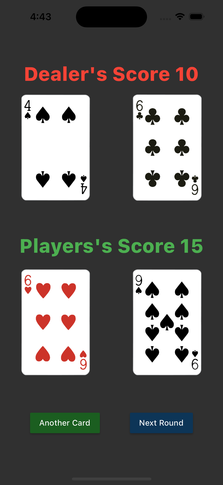
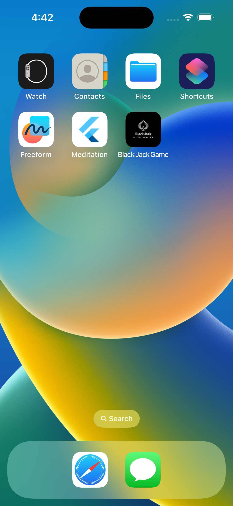
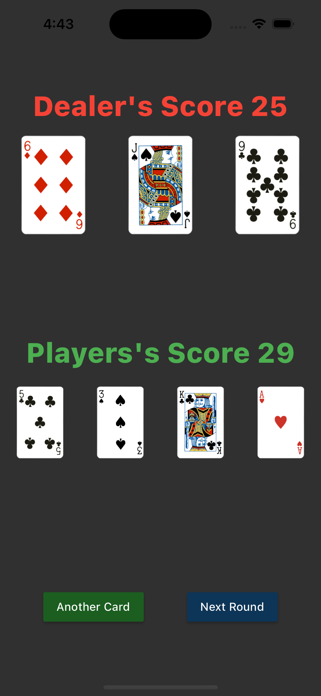

# Black Jack Game

A simple Flutter project implementing the popular card game Black Jack.

## Description

Black Jack Game is a mobile application built using the Flutter framework. It allows users to play the classic card game Black Jack against a computer dealer. The objective of the game is to get a hand value as close to 21 as possible without exceeding it.

## Screenshots

<!-- Add screenshots of your application below -->





## Features

- Interactive gameplay with smooth animations.
- Simple and intuitive user interface.
- Basic rules of Black Jack implemented.
- Play against a computer dealer.
- Track your score and game statistics.

## Installation

1. Clone the repository to your local machine:
   ```
   git clone https://github.com/your-username/blackjack-game.git
   ```

2. Change your current directory to the project folder:
   ```
   cd blackjack-game
   ```

3. Run the following command to install the required dependencies:
   ```
   flutter pub get
   ```

4. Connect your mobile device or start an emulator.

5. Launch the application using the following command:
   ```
   flutter run
   ```

## Contributing

Contributions are welcome! If you find any bugs or want to add new features, please submit an issue or create a pull request.

## License

This project is licensed under the [MIT License](LICENSE).